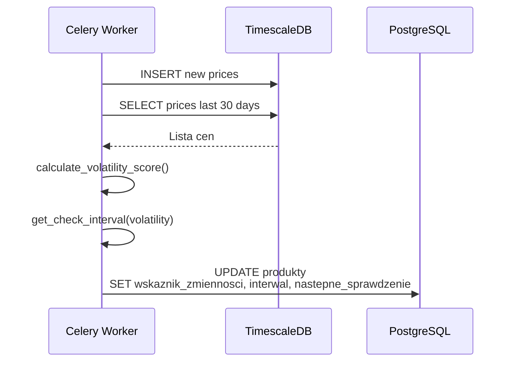
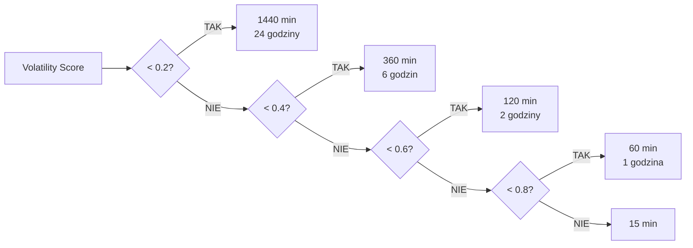

# Wskaźnik Zmienności (Volatility Score)

## 1. Wprowadzenie

**Wskaźnik zmienności** (volatility score) to miara opisująca, jak bardzo cena produktu zmienia się w czasie. System Price History wykorzystuje go do **dynamicznego harmonogramowania sprawdzania cen** (smart polling) - im bardziej zmienny produkt, tym częściej sprawdzamy cenę.

### 1.1 Cel algorytmu

- **Optymalizacja zasobów** - rzadkie sprawdzanie stabilnych produktów (książki, meble)
- **Szybkie wykrywanie okazji** - częste sprawdzanie zmiennych produktów (elektronika, GPU)
- **Redukcja ryzyka blokady** - mniej zapytań do platform z ograniczonym rate-limit

---

## 2. Podstawy matematyczne

### 2.1 Współczynnik wariacji (Coefficient of Variation, CV)

Standardowa miara zmienności w statystyce, niezależna od skali (cena 100 PLN i 10000 PLN porównywalna):

$$CV = \frac{\sigma}{\mu}$$

gdzie:
- $\sigma$ - odchylenie standardowe ceny
- $\mu$ - średnia cena

**Interpretacja:**
- $CV \approx 0$ → cena bardzo stabilna
- $CV = 0.1$ → cena waha się o 10% średniej
- $CV \geq 0.3$ → cena wysoce zmienna

### 2.2 Dlaczego CV, nie czyste odchylenie standardowe?

| Produkt | Średnia | σ | CV |
|---------|---------|---|-----|
| Książka | 30 PLN | 3 PLN | 0.10 |
| GPU | 3000 PLN | 300 PLN | 0.10 |
| iPhone | 5000 PLN | 50 PLN | 0.01 |

Bez CV, GPU miałoby σ=300 a książka σ=3 - GPU wyglądałby na "100x bardziej zmienny", choć procentowo tak samo. CV normalizuje te wartości.

---

## 3. Algorytm obliczania volatility_score

### 3.1 Pseudokod

```
function calculate_volatility_score(produkt_id):
    # Pobierz najniższe ceny z ostatnich 30 dni
    ceny = SELECT cena FROM historia_cen
           WHERE produkt_id = produkt_id
             AND jest_najnizsza = TRUE
             AND czas >= NOW() - INTERVAL '30 days'

    # Wymagamy minimum 5 pomiarów dla rzetelności
    if len(ceny) < 5:
        return 0.5  # Domyślna wartość dla nowych produktów

    srednia = mean(ceny)
    odchylenie = std(ceny)

    # Współczynnik wariacji
    if srednia == 0:
        return 0.0
    cv = odchylenie / srednia

    # Normalizacja do [0, 1]
    # CV = 0.3 (wysoka zmienność) → volatility = 1.0
    volatility = min(cv / 0.3, 1.0)

    return round(volatility, 2)
```

### 3.2 Implementacja w Pythonie (Pandas)

```python
import pandas as pd
import numpy as np

def calculate_volatility_score(product_id: int) -> float:
    """
    Calculate volatility score based on coefficient of variation.

    Returns float in range [0.0, 1.0]:
    - 0.0: very stable
    - 0.5: default for products with insufficient data
    - 1.0: highly volatile
    """
    prices = fetch_prices_from_timescaledb(
        product_id=product_id,
        days=30,
        only_lowest=True
    )

    if len(prices) < 5:
        return 0.5

    df = pd.DataFrame(prices, columns=['price'])
    mean_price = df['price'].mean()
    std_price = df['price'].std()

    if mean_price == 0:
        return 0.0

    cv = std_price / mean_price
    volatility = min(cv / 0.3, 1.0)

    return round(float(volatility), 2)
```

### 3.3 Kiedy obliczamy?

Volatility score jest obliczany **po każdym fetch** ceny:



---

## 4. Mapowanie volatility → interwał sprawdzania

### 4.1 Tabela mapowania

| Volatility Score | Interwał | Użytkowanie | Przykłady |
|------------------|----------|-------------|-----------|
| 0.0 - 0.2 | 1440 min (24h) | Bardzo stabilne | Książki, podręczniki |
| 0.2 - 0.4 | 360 min (6h) | Stabilne | Meble, AGD |
| 0.4 - 0.6 | 120 min (2h) | Umiarkowane | Smartfony bez akcji |
| 0.6 - 0.8 | 60 min (1h) | Zmienne | Laptopy, monitory |
| 0.8 - 1.0 | 15 min | Wysoce zmienne | GPU, Black Friday |

### 4.2 Implementacja

```python
def get_check_interval(volatility_score: float) -> int:
    """
    Map volatility score to check interval in minutes.
    """
    if volatility_score < 0.2:
        return 1440  # 24 hours
    elif volatility_score < 0.4:
        return 360   # 6 hours
    elif volatility_score < 0.6:
        return 120   # 2 hours
    elif volatility_score < 0.8:
        return 60    # 1 hour
    else:
        return 15    # 15 minutes
```

### 4.3 Wizualizacja



---

## 5. Edge cases i obsługa błędów

### 5.1 Nowy produkt (mało danych)

**Problem:** Produkt dodany dzisiaj ma 1-2 pomiary - statystyki niemiarodajne.

**Rozwiązanie:**
- Wymagamy min. 5 pomiarów
- Domyślny volatility = 0.5 (interwał 2h - umiarkowane sprawdzanie)
- Po zebraniu 5+ pomiarów algorytm zaczyna działać

### 5.2 Produkt niedostępny (brak ceny)

**Problem:** Sprzedawca wycofał ofertę - brak nowej ceny.

**Rozwiązanie:**
- Nie liczymy "braku ceny" jako 0
- Pomiar pomijany
- Jeśli produkt niedostępny przez 7+ dni → flag `aktywny = FALSE`

### 5.3 Anomalie wpływające na CV

**Problem:** Pojedyncza flash sale (-50%) może gwałtownie zwiększyć CV i zmienić volatility na "wysoce zmienny" - co spowoduje nadmierne odpytywanie.

**Rozwiązanie:**
- Można użyć **trimmed mean/std** (usunąć outliers)
- Alternatywnie: rolling window 14 dni zamiast 30 dni dla bardziej responsive volatility
- Aktualnie: akceptujemy ten efekt (po flash sale rzeczywiście warto sprawdzać częściej, bo może się powtórzyć)

### 5.4 Cena = 0

**Problem:** Bug w scrapingu może zwrócić cenę 0.

**Rozwiązanie:**
- Walidacja: `if cena <= 0: skip insert`
- Jeśli średnia = 0 → volatility = 0 (zabezpieczenie przed dzieleniem przez zero)

---

## 6. Walidacja i testy

### 6.1 Test cases

```python
def test_volatility_stable_product():
    """Stabilna cena → niska volatility"""
    prices = [30.0, 30.5, 30.0, 30.2, 30.1, 30.0]
    expected_volatility = 0.0  # CV ≈ 0.005, daleko od 0.3

def test_volatility_volatile_product():
    """Zmienna cena → wysoka volatility"""
    prices = [3000, 2700, 3200, 2500, 3100, 2800]
    expected_volatility ≈ 0.3  # CV ≈ 0.09

def test_volatility_extreme_volatility():
    """Bardzo zmienna cena → maksymalna volatility"""
    prices = [1000, 500, 1500, 300, 1200, 600]
    expected_volatility = 1.0  # CV > 0.3

def test_volatility_insufficient_data():
    """< 5 pomiarów → domyślna 0.5"""
    prices = [100, 110, 105]
    expected_volatility = 0.5

def test_volatility_zero_mean():
    """Średnia = 0 → volatility = 0"""
    prices = [0, 0, 0, 0, 0]
    expected_volatility = 0.0
```

### 6.2 Manualne sprawdzenie

```sql
-- Zobacz produkty z najwyższą volatility
SELECT
    p.id,
    p.nazwa,
    p.wskaznik_zmiennosci,
    p.interwal_sprawdzania_min,
    p.liczba_sprzedawcow
FROM produkty p
WHERE p.aktywny = TRUE
ORDER BY p.wskaznik_zmiennosci DESC
LIMIT 20;
```

---

## 7. Przyszłe ulepszenia

### 7.1 Adaptive thresholds

Obecnie próg CV=0.3 jest sztywny. Można wykrywać dla różnych kategorii:
- **Elektronika:** próg = 0.2 (większe wahania normalne)
- **Książki:** próg = 0.5 (rzadkie zmiany cen)

### 7.2 Time-of-day awareness

Niektóre produkty mają zmienność związaną z porą dnia:
- Promocje weekendowe
- Black Friday / Cyber Monday
- Godziny "najgorętsze" (np. 18:00-22:00)

System mógłby dostosować częstotliwość do pory dnia.

### 7.3 Trend detection

Oprócz volatility - wykrywanie trendu:
- Stała cena spada → warto śledzić częściej (może spadnie jeszcze)
- Stała cena rośnie → być może przegapiamy okazje

### 7.4 Machine Learning

Model ML mógłby przewidywać optymalny interwał na podstawie:
- Historycznej volatility
- Pora dnia / dnia tygodnia
- Sezonowości (Black Friday, święta)
- Kategorii produktu

To rozszerzenie planowane jest jako v2 (przewidywanie cen).

---

## 8. Powiązane dokumenty

- [Smart Polling - architektura](../zadania-w-tle/smart-polling.md) - jak system używa volatility
- [Wykrywanie anomalii](wykrywanie-anomalii.md) - Z-score detection
- [Silnik statystyk](silnik-statystyk.md) - Pandas vs DB queries
