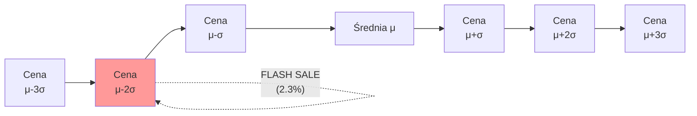
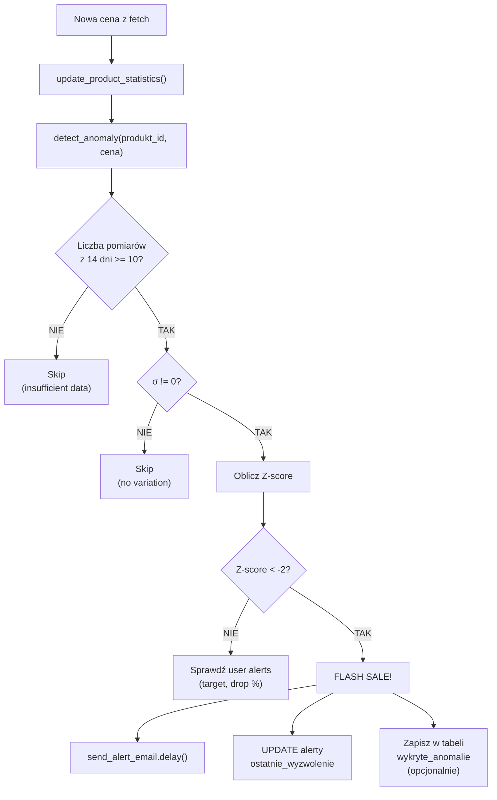

# Wykrywanie Anomalii (Flash Sale Detector)

## 1. Wprowadzenie

System Price History wykorzystuje statystyczną detekcję anomalii do automatycznego wykrywania **flash sales** - błyskawicznych promocji, które trwają krótko i są łatwe do przegapienia. Algorytm działa bez konieczności ręcznego ustawiania progów cenowych przez użytkownika.

### 1.1 Problem

Tradycyjne alerty cenowe wymagają od użytkownika:
- Wiedzy o "normalnej" cenie produktu
- Ustawienia konkretnego progu (np. "powiadom mnie poniżej 2200 PLN")
- Stałej aktualizacji progu, gdy zmieniają się trendy

**Wynik:** Użytkownicy ustawiają zbyt niskie progi i przegapiają umiarkowane okazje, lub zbyt wysokie i dostają nieistotne powiadomienia.

### 1.2 Rozwiązanie

System uczy się "normalnego" zachowania ceny każdego produktu i automatycznie flaguje **odchylenia statystycznie istotne**.

---

## 2. Podstawy matematyczne

### 2.1 Z-score (standardowy wynik)

**Z-score** mierzy, jak daleko dana wartość jest od średniej, w jednostkach odchylenia standardowego:

$$Z = \frac{x - \mu}{\sigma}$$

gdzie:
- $x$ - aktualna cena
- $\mu$ - średnia cena (z okna czasowego)
- $\sigma$ - odchylenie standardowe ceny

**Interpretacja:**
| Z-score | Znaczenie |
|---------|-----------|
| Z = 0 | Cena równa średniej |
| Z = -1 | Cena 1 σ poniżej średniej (~16% ofert tańszych) |
| Z = -2 | Cena 2 σ poniżej średniej (~2.3% ofert tańszych) |
| Z = -3 | Cena 3 σ poniżej średniej (~0.13% ofert tańszych) |

### 2.2 Dlaczego próg Z = -2?

W rozkładzie normalnym:
- **68% wartości** mieści się w zakresie [μ-σ, μ+σ]
- **95% wartości** mieści się w zakresie [μ-2σ, μ+2σ]
- **99.7% wartości** mieści się w zakresie [μ-3σ, μ+3σ]



**Próg Z < -2** oznacza: "Cena jest niższa niż 97.7% historycznych cen" → **bardzo prawdopodobnie flash sale**.

### 2.3 Dlaczego nie Z = -1?

Z = -1 byłoby zbyt czułe:
- 16% pomiarów przekroczyłoby próg
- Setki fałszywych alertów dziennie
- Spam dla użytkownika

### 2.4 Dlaczego nie Z = -3?

Z = -3 byłoby za mało czułe:
- Tylko 0.13% pomiarów - praktycznie nigdy
- Przegapilibyśmy umiarkowane flash sales (-15 do -25%)

**Z = -2 to optymalny balance** między czułością a precyzją.

---

## 3. Okno czasowe (rolling window)

### 3.1 Wybór: 14 dni

System używa **14-dniowego okna** do obliczania średniej i odchylenia:

| Okno | Plusy | Minusy |
|------|-------|--------|
| 7 dni | Szybka adaptacja do trendów | Mało danych, wysoka wariancja |
| **14 dni** | **Balance, wystarczająca dokładność** | **Optymalne** |
| 30 dni | Bardziej stabilne statystyki | Wolna adaptacja do trendów (np. spadek po Black Friday) |
| 90 dni | Bardzo stabilne | Może przegapić sezonowe trendy |

### 3.2 Adaptacja do trendów

**Problem:** Co jeśli cena spada systematycznie (trend), ale powoli?

```
Dzień 1:  3000 PLN
Dzień 7:  2900 PLN
Dzień 14: 2800 PLN
Dzień 21: 2700 PLN
```

Bez adaptacji algorytm zawsze flagowałby najnowsze ceny jako anomalie. **Rolling window 14 dni** rozwiązuje to:
- Stara cena (3000) "wypada" z okna
- Nowa średnia ~ 2800
- Cena 2700 to tylko -1 σ od nowej średniej → nie anomalia

---

## 4. Algorytm detekcji

### 4.1 Pseudokod

```
function detect_anomaly(produkt_id, aktualna_cena):
    # Pobierz statystyki z 14 dni
    statystyki = SELECT AVG(cena), STDDEV(cena), COUNT(*)
                 FROM historia_cen
                 WHERE produkt_id = produkt_id
                   AND jest_najnizsza = TRUE
                   AND czas >= NOW() - INTERVAL '14 days'

    # Wymagamy minimum 10 pomiarów dla rzetelności
    if statystyki.count < 10:
        return {
            'is_anomaly': False,
            'reason': 'insufficient_data'
        }

    # Zabezpieczenie przed dzieleniem przez zero
    if statystyki.stddev == 0:
        return {
            'is_anomaly': False,
            'reason': 'no_price_variation'
        }

    # Oblicz Z-score
    z_score = (aktualna_cena - statystyki.avg) / statystyki.stddev

    # Wykrywamy spadki (Z < -2), nie wzrosty
    is_anomaly = z_score < -2

    return {
        'is_anomaly': is_anomaly,
        'z_score': z_score,
        'srednia_okolic': statystyki.avg,
        'odchylenie': statystyki.stddev,
        'spadek_procent': ((aktualna_cena - statystyki.avg) / statystyki.avg) * 100
    }
```

### 4.2 Implementacja w Pythonie

```python
from decimal import Decimal
from typing import TypedDict

class AnomalyResult(TypedDict):
    is_anomaly: bool
    z_score: float | None
    srednia_okolic: Decimal | None
    odchylenie: Decimal | None
    spadek_procent: float | None

def detect_anomaly(product_id: int, current_price: Decimal) -> AnomalyResult:
    """
    Z-score based flash sale detection.

    Returns is_anomaly=True if price is more than 2 standard
    deviations below the 14-day average.
    """
    stats = get_price_stats_from_timescaledb(
        product_id=product_id,
        days=14,
        only_lowest=True
    )

    if stats['count'] < 10:
        return {'is_anomaly': False, 'z_score': None, ...}

    if stats['stddev'] == 0:
        return {'is_anomaly': False, 'z_score': None, ...}

    z_score = float((current_price - stats['avg']) / stats['stddev'])
    drop_percent = float((current_price - stats['avg']) / stats['avg']) * 100

    return {
        'is_anomaly': z_score < -2,
        'z_score': round(z_score, 2),
        'srednia_okolic': stats['avg'],
        'odchylenie': stats['stddev'],
        'spadek_procent': round(drop_percent, 2)
    }
```

### 4.3 Flow detekcji



---

## 5. Anti-spam mechanizmy

### 5.1 Cooldown po wykryciu

**Problem:** Cena spadła o 30% - pozostaje przez 6 godzin. Algorytm wykryłby anomalię przy każdym fetch (nawet co 15 min).

**Rozwiązanie:**
```python
def should_trigger_alert(alert, current_price):
    if alert.ostatnie_wyzwolenie is None:
        return True

    cooldown = timedelta(hours=6)
    time_since_last = timezone.now() - alert.ostatnie_wyzwolenie

    return time_since_last > cooldown
```

**Reguła:** Alert dla danej grupy może wyzwolić się **maksymalnie raz na 6 godzin**.

### 5.2 Powtórne anomalie

Jeśli cena jest już niska (po pierwszym alercie), kolejne pomiary nie powinny generować nowych alertów:

- Alert 1: cena 2199 PLN (-15%) → Z=-2.5 → ALERT
- Po 30 minutach: cena 2199 PLN → Z=-2.4 → SKIP (cooldown)
- Po 6 godzinach: cena 2150 PLN → Z=-2.8 → ALERT (jeszcze niższa)

---

## 6. Przykłady i analiza

### 6.1 Przykład 1: Stabilny produkt

**Produkt:** Książka, cena waha się 25-30 PLN

```
Statystyki 14 dni:
- średnia = 27.5 PLN
- σ = 1.5 PLN
- count = 14

Aktualna cena: 26 PLN
Z-score = (26 - 27.5) / 1.5 = -1.0
→ NIE anomalia (Z > -2)
```

### 6.2 Przykład 2: Flash sale GPU

**Produkt:** GPU RTX 4080

```
Statystyki 14 dni:
- średnia = 2549 PLN
- σ = 124 PLN
- count = 56

Aktualna cena: 2199 PLN (Black Friday)
Z-score = (2199 - 2549) / 124 = -2.82
→ FLASH SALE! (Z < -2)
Spadek: -13.7%
```

### 6.3 Przykład 3: Wolny trend spadkowy

**Produkt:** Smartfon w fazie wycofywania

```
Tydzień 1: 2500-2600 PLN
Tydzień 2: 2400-2500 PLN
Tydzień 3: 2300-2400 PLN

Statystyki 14 dni (tydzień 2-3):
- średnia = 2400 PLN
- σ = 70 PLN

Aktualna cena: 2350 PLN
Z-score = (2350 - 2400) / 70 = -0.71
→ NIE anomalia (algorytm "uczy się" trendu)
```

---

## 7. Edge cases

### 7.1 Nowy produkt (mało danych)

**Próg:** min. 10 pomiarów w oknie 14 dni.

**Konsekwencja:** Pierwsze 1-3 dni produkt nie jest monitorowany pod kątem flash sales.

**Mitygacja:** Użytkownik może ustawić alert ręczny (target price) na początku.

### 7.2 Niezmienna cena

Jeśli cena jest zawsze ta sama (np. 2999 PLN przez miesiąc):
- σ = 0
- Algorytm zwraca `is_anomaly = False` (zabezpieczenie)
- Pierwsza zmiana ceny zacznie budować nową statystykę

### 7.3 Drastyczny spadek (>50%)

Jeśli Z-score = -5 (skrajna anomalia):
- Może być błąd scrapowania (np. strona zwróciła "00.00 PLN")
- **Walidacja:** odrzuć ceny < 1% średniej jako prawdopodobne błędy
- Alternatywnie: oznacz alertem "wymaga weryfikacji"

```python
def is_price_realistic(current_price, avg_price):
    """Zabezpieczenie przed bug-em w scraperze"""
    if current_price < avg_price * 0.05:
        # Cena <5% średniej - prawdopodobnie błąd
        return False
    return True
```

### 7.4 Wysokie zmienne produkty

Produkty o wysokiej naturalnej zmienności (CV > 0.3) mają duże σ. Trudniej wykryć anomalię (próg Z=-2 dotyczy większego absolutnego spadku).

**To jest CECHA**, nie bug:
- Stabilny produkt: -5% to anomalia
- Zmienny produkt: -5% to normalne, dopiero -20% to anomalia

---

## 8. Walidacja i testy

### 8.1 Test cases

```python
def test_anomaly_obvious_flash_sale():
    """Cena 25% poniżej średniej → anomalia"""
    prices = [3000] * 14  # σ = 0... źle
    # Lepiej:
    prices = [2950, 3000, 3050, ...]  # σ ≈ 50
    current = 2200
    # Z = (2200 - 3000) / 50 = -16 → ANOMALY

def test_anomaly_normal_fluctuation():
    """Normalna fluktuacja → NIE anomalia"""
    # Z ≈ -1.5 → not anomaly

def test_anomaly_insufficient_data():
    """< 10 pomiarów → skip"""

def test_anomaly_zero_stddev():
    """Stała cena → skip"""

def test_anomaly_invalid_price():
    """Cena podejrzanie niska → skip + log"""
```

### 8.2 Manualna weryfikacja

```sql
-- Lista wykrytych anomalii w ostatnim tygodniu
SELECT
    p.nazwa,
    h.czas,
    h.cena,
    p.srednia_cena_30d,
    (h.cena - p.srednia_cena_30d) / p.odchylenie_std_30d AS z_score
FROM historia_cen h
JOIN produkty p ON h.produkt_id = p.id
WHERE h.czas >= NOW() - INTERVAL '7 days'
  AND p.odchylenie_std_30d > 0
  AND (h.cena - p.srednia_cena_30d) / p.odchylenie_std_30d < -2
  AND h.jest_najnizsza = TRUE
ORDER BY z_score ASC
LIMIT 50;
```

---

## 9. Metryki i monitoring

### 9.1 Kluczowe metryki

| Metryka | Cel | Próg alarmu |
|---------|-----|-------------|
| Liczba alertów/dzień | < 100 | > 1000 (potencjalnie spam) |
| False positive rate | < 10% | > 30% |
| Średnie opóźnienie wykrycia | < 30 min | > 2h |
| Pokrycie produktów | > 90% (z odpowiednią ilością danych) | < 50% |

### 9.2 A/B testing parametrów

W przyszłości można testować różne parametry:
- Próg Z-score (-1.5, -2.0, -2.5)
- Okno czasowe (7, 14, 30 dni)
- Min. liczba pomiarów (5, 10, 20)

---

## 10. Przyszłe ulepszenia

### 10.1 Wieloetapowa detekcja

Zamiast jednego progu - kategoryzacja:
- **Mała okazja:** Z < -1.5
- **Dobra okazja:** Z < -2.0 ✅ (obecnie)
- **Świetna okazja:** Z < -2.5
- **Super okazja:** Z < -3.0

Użytkownik wybiera, na jakim poziomie chce być powiadamiany.

### 10.2 ARIMA / Prophet (forecasting)

Modele szeregów czasowych mogą **przewidywać** "expected price" zamiast używać prostej średniej. Pozwoli to wykrywać anomalie nawet w obecności silnego trendu.

### 10.3 Detekcja oparta na ML

Można trenować model klasyfikacyjny:
- Features: Z-score, trend, dzień tygodnia, godzina, kategoria produktu
- Label: "user clicked the alert" (czy alert był użyteczny)

Model uczyłby się, jakie alerty rzeczywiście interesują użytkownika.

### 10.4 Cross-platform anomaly

Wykrywanie anomalii w **kontekście grupy** (cross-platform):
- Cena na Allegro spadła o 5% (Z = -1.5, NIE anomalia per platforma)
- Cena na Amazon też spadła o 5%
- **Łącznie:** najniższa cena cross-platform spadła o 5% → anomalia (oba platformy się obniżyły)

---

## 11. Powiązane dokumenty

- [Wskaźnik zmienności](wskaznik-zmiennosci.md) - smart polling
- [Silnik statystyk](silnik-statystyk.md) - implementacja Pandas
- [Definicje tasków Celery](../zadania-w-tle/definicje-taskow.md) - send_alert_email
