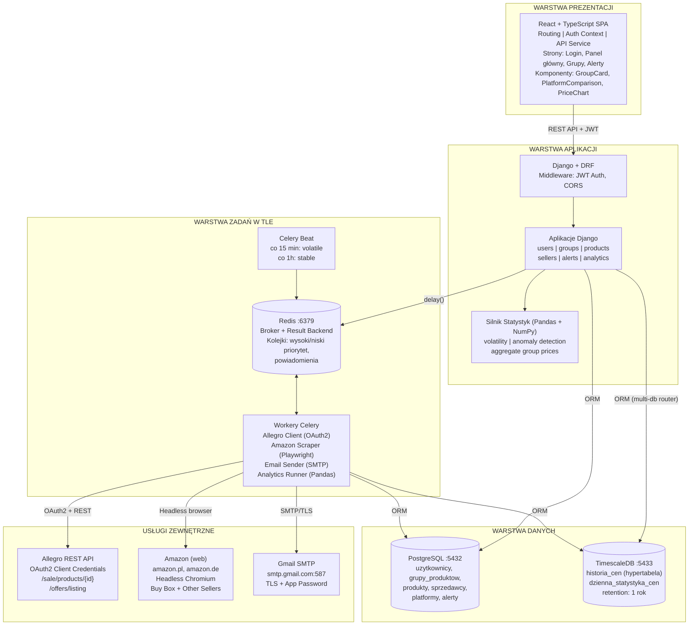
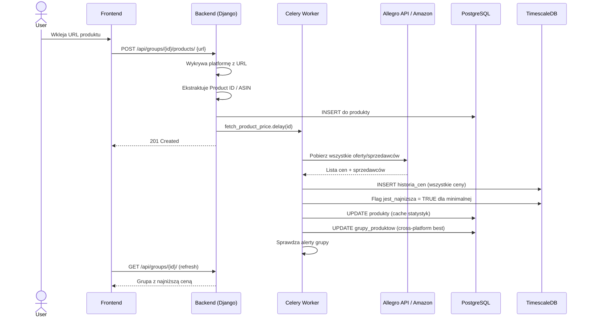
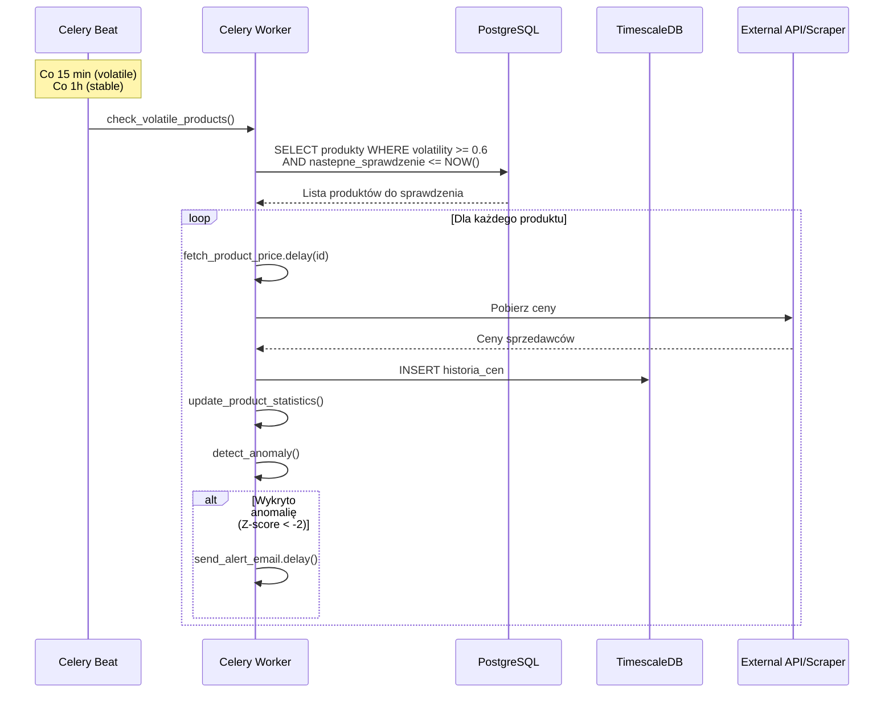
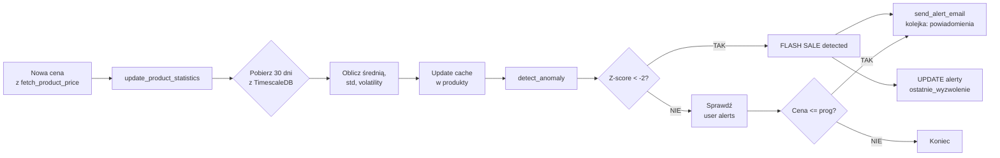
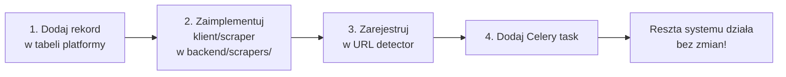

# Diagram Komponentów

## 1. Wprowadzenie

Dokument przedstawia szczegółowy diagram komponentów systemu Price History wraz z opisem interakcji między nimi. System składa się z czterech głównych warstw: prezentacji (frontend), aplikacji (backend), zadań w tle (workers) oraz warstwy danych (bazy danych).

---

## 2. Pełny diagram architektury

---

## 3. Opis komponentów

### 3.1 Warstwa prezentacji (Frontend)

#### React SPA (Single Page Application)
**Odpowiedzialność:** Interfejs użytkownika, zarządzanie stanem, komunikacja z API

**Kluczowe komponenty:**
- **Router** - nawigacja między stronami (React Router)
- **Auth Context** - zarządzanie tokenami JWT, stan zalogowania
- **API Service** - centralna warstwa komunikacji z backendem (Axios)
- **Strony** - widoki aplikacji (Login, Panel główny, Szczegóły grupy, Alerty)
- **Komponenty wielokrotnego użytku** - GroupCard, PlatformComparison, PriceChart, SellerList

### 3.2 Warstwa aplikacji (Backend)

#### Django + DRF
**Odpowiedzialność:** Logika biznesowa, REST API, uwierzytelnianie

**Aplikacje Django:**

| Aplikacja | Odpowiedzialność |
|-----------|------------------|
| `users` | Rejestracja, logowanie, JWT, profil |
| `groups` | Grupy produktów (cross-platform) |
| `products` | Produkty per platforma w grupie |
| `sellers` | Sprzedawcy odkryci podczas scrapowania |
| `alerts` | Alerty cenowe (na poziomie grupy) |
| `analytics` | Endpointy statystyczne |

#### Silnik Statystyk
**Odpowiedzialność:** Obliczenia analityczne, wykrywanie anomalii

**Funkcje:**
- `calculate_volatility_score()` - oblicza wskaźnik zmienności (CV)
- `update_product_statistics()` - aktualizuje cache statystyk produktu
- `detect_anomaly()` - wykrywa flash sale na podstawie Z-score
- `get_check_interval()` - mapuje volatility na interwał sprawdzania
- `aggregate_group_prices()` - znajduje najniższą cenę cross-platform

### 3.3 Warstwa zadań w tle (Workers)

#### Celery
**Odpowiedzialność:** Asynchroniczne zadania, cykliczne sprawdzanie cen

**Multi-queue architecture:**

| Kolejka | Zadania | Częstotliwość |
|---------|---------|---------------|
| `wysoki_priorytet` | Sprawdzanie produktów zmiennych | Co 15 min |
| `niski_priorytet` | Sprawdzanie produktów stabilnych | Co 1-24h |
| `powiadomienia` | Wysyłka emaili | Natychmiast |

**Workery:**
- **Allegro Client** - OAuth2, pobieranie wszystkich ofert produktu
- **Amazon Scraper** - Playwright, scraping Buy Box + Other Sellers
- **Email Sender** - wysyłka powiadomień przez Gmail SMTP
- **Analytics Runner** - obliczenia Pandas po każdym fetch

#### Celery Beat
**Odpowiedzialność:** Harmonogramowanie cyklicznych zadań

### 3.4 Warstwa danych

#### PostgreSQL
**Odpowiedzialność:** Dane transakcyjne (relacyjne)

**Tabele:**
- `uzytkownicy` - konta użytkowników
- `grupy_produktow` - grupy do cross-platform comparison
- `produkty` - produkty per platforma w grupie
- `sprzedawcy` - sprzedawcy odkryci podczas scrapowania
- `platformy` - dostępne platformy (Allegro, Amazon)
- `alerty` - alerty użytkownika

#### TimescaleDB
**Odpowiedzialność:** Szeregi czasowe (historia cen)

**Hypertabele:**
- `historia_cen` - wszystkie ceny ze wszystkich sprzedawców
  - Flag `jest_najnizsza` dla najniższej ceny w danym timestamp
  - Indeks specjalny dla najniższych cen

**Materialized views:**
- `dzienna_statystyka_cen` - agregaty dzienne (continuous aggregate)

#### Redis
**Odpowiedzialność:** Message broker dla Celery

**Zastosowanie:**
- Kolejki zadań (multi-queue)
- Result backend (wyniki zadań)
- Możliwość rozszerzenia o cache (przyszłość)

---

## 4. Przepływy komunikacji

### 4.1 Dodawanie produktu do grupy

### 4.2 Cykliczne sprawdzanie cen (smart polling)

### 4.3 Detekcja flash sale

---

## 5. Zewnętrzne zależności

| Usługa | Typ | Cel | Limity |
|--------|-----|-----|--------|
| Allegro REST API | API (OAuth2) | Pobieranie ofert produktu | Rate limit: 9000 req/min |
| Amazon | Web (HTML) | Scraping cen sprzedawców | Anti-bot: rotate UA, delays |
| Gmail SMTP | SMTP | Wysyłka powiadomień email | 500 emaili/dzień (free) |

---

## 6. Skalowalność i rozszerzalność

### 6.1 Dodawanie nowej platformy

Architektura pozwala na łatwe dodanie nowej platformy (np. MediaExpert):

Komponenty bez zmian: analityka, alerty, frontend, smart polling, detekcja anomalii.

### 6.2 Skalowanie poziome

- **Wiele workerów Celery** - każdy obsługuje różne kolejki
- **Replikacja PostgreSQL** - read replicas dla analityki
- **TimescaleDB chunking** - automatyczne partycjonowanie po czasie
- **CDN dla frontendu** - statyczne assety

---

## 7. Bezpieczeństwo

### 7.1 Uwierzytelnianie i autoryzacja

- **JWT tokens** - access (15 min) + refresh (7 dni)
- **Hasła** - hashowane przez Django (PBKDF2-SHA256)
- **Permissions** - użytkownik widzi tylko swoje grupy

### 7.2 Sekrety

Przechowywane w zmiennych środowiskowych (`.env`):
- `ALLEGRO_CLIENT_ID`, `ALLEGRO_CLIENT_SECRET`
- `GMAIL_USER`, `GMAIL_APP_PASSWORD`
- `JWT_SECRET_KEY`
- `DATABASE_URL`, `TIMESCALEDB_URL`

### 7.3 Komunikacja zewnętrzna

- HTTPS dla wszystkich endpointów
- TLS dla Gmail SMTP
- OAuth2 dla Allegro
