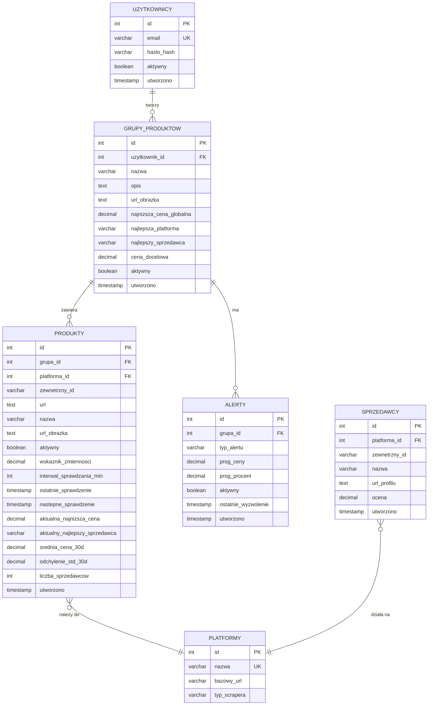

# Schemat PostgreSQL (Dane Transakcyjne)

## 1. Wprowadzenie

PostgreSQL przechowuje dane transakcyjne aplikacji - użytkowników, grupy produktów, produkty per platforma, sprzedawców i alerty. Historia cen jest przechowywana osobno w TimescaleDB (zob. `schemat-timescaledb.md`).

**Konfiguracja:**
- Wersja: PostgreSQL 15
- Port: 5432
- Database: `price_history`

---

## 2. Diagram ER (Entity Relationship)



---

## 3. Definicje tabel

### 3.1 `uzytkownicy`

Konta użytkowników aplikacji.

```sql
CREATE TABLE uzytkownicy (
    id SERIAL PRIMARY KEY,
    email VARCHAR(255) UNIQUE NOT NULL,
    haslo_hash VARCHAR(255) NOT NULL,
    aktywny BOOLEAN DEFAULT TRUE,
    utworzono TIMESTAMP DEFAULT NOW()
);

CREATE INDEX idx_uzytkownicy_email ON uzytkownicy(email);
```

| Kolumna | Typ | Opis |
|---------|-----|------|
| `id` | SERIAL | Klucz główny |
| `email` | VARCHAR(255) | Email użytkownika (unikalny, login) |
| `haslo_hash` | VARCHAR(255) | Hash hasła (PBKDF2-SHA256 przez Django) |
| `aktywny` | BOOLEAN | Czy konto jest aktywne |
| `utworzono` | TIMESTAMP | Data rejestracji |

---

### 3.2 `platformy`

Konfiguracja dostępnych platform (Allegro, Amazon).

```sql
CREATE TABLE platformy (
    id SERIAL PRIMARY KEY,
    nazwa VARCHAR(100) UNIQUE NOT NULL,
    bazowy_url VARCHAR(255),
    typ_scrapera VARCHAR(20) NOT NULL  -- 'api' lub 'web'
);

-- Inicjalne dane
INSERT INTO platformy (nazwa, bazowy_url, typ_scrapera) VALUES
    ('allegro', 'https://allegro.pl', 'api'),
    ('amazon', 'https://amazon.pl', 'web');
```

| Kolumna | Typ | Opis |
|---------|-----|------|
| `id` | SERIAL | Klucz główny |
| `nazwa` | VARCHAR(100) | Identyfikator platformy ('allegro', 'amazon') |
| `bazowy_url` | VARCHAR(255) | URL bazowy platformy |
| `typ_scrapera` | VARCHAR(20) | 'api' (oficjalne API) lub 'web' (scraping) |

---

### 3.3 `grupy_produktow`

Grupy produktów tworzone przez użytkownika do cross-platform comparison.

```sql
CREATE TABLE grupy_produktow (
    id SERIAL PRIMARY KEY,
    uzytkownik_id INTEGER NOT NULL REFERENCES uzytkownicy(id) ON DELETE CASCADE,
    nazwa VARCHAR(255) NOT NULL,
    opis TEXT,
    url_obrazka TEXT,

    -- Aggregated data (best across ALL platforms in group)
    najnizsza_cena_globalna DECIMAL(10,2),
    najlepsza_platforma VARCHAR(100),
    najlepszy_sprzedawca VARCHAR(255),

    -- User preferences (apply to whole group)
    cena_docelowa DECIMAL(10,2),
    aktywny BOOLEAN DEFAULT TRUE,

    utworzono TIMESTAMP DEFAULT NOW()
);

CREATE INDEX idx_grupy_uzytkownik ON grupy_produktow(uzytkownik_id);
CREATE INDEX idx_grupy_aktywny ON grupy_produktow(aktywny) WHERE aktywny = TRUE;
```

| Kolumna | Typ | Opis |
|---------|-----|------|
| `id` | SERIAL | Klucz główny |
| `uzytkownik_id` | INTEGER FK | Właściciel grupy |
| `nazwa` | VARCHAR(255) | Nazwa grupy (np. "RTX 4080") |
| `opis` | TEXT | Opcjonalny opis |
| `url_obrazka` | TEXT | URL obrazka grupy |
| `najnizsza_cena_globalna` | DECIMAL | **Cache:** najniższa cena cross-platform |
| `najlepsza_platforma` | VARCHAR | Platforma z najlepszą ceną |
| `najlepszy_sprzedawca` | VARCHAR | Sprzedawca z najlepszą ceną |
| `cena_docelowa` | DECIMAL | Próg dla alertu (opcjonalnie) |
| `aktywny` | BOOLEAN | Czy grupa jest aktywnie monitorowana |

**Kluczowa decyzja:** Pola `najnizsza_*` są cache aktualizowanym po każdym fetch produktu w grupie. Pozwala to na szybkie wyświetlanie listy grup bez obliczania min() przy każdym żądaniu.

---

### 3.4 `produkty`

Produkty per platforma w ramach grupy.

```sql
CREATE TABLE produkty (
    id SERIAL PRIMARY KEY,
    grupa_id INTEGER NOT NULL REFERENCES grupy_produktow(id) ON DELETE CASCADE,
    platforma_id INTEGER NOT NULL REFERENCES platformy(id),

    -- Product identifier (extracted from URL)
    zewnetrzny_id VARCHAR(255) NOT NULL,
    url TEXT NOT NULL,

    -- Product info (from API/scraper)
    nazwa VARCHAR(500),
    url_obrazka TEXT,

    aktywny BOOLEAN DEFAULT TRUE,

    -- Smart Polling fields
    wskaznik_zmiennosci DECIMAL(5,2) DEFAULT 0.5
        CHECK (wskaznik_zmiennosci >= 0 AND wskaznik_zmiennosci <= 1),
    interwal_sprawdzania_min INTEGER DEFAULT 360,
    ostatnie_sprawdzenie TIMESTAMP,
    nastepne_sprawdzenie TIMESTAMP,

    -- Analytics cache (BEST price on THIS platform)
    aktualna_najnizsza_cena DECIMAL(10,2),
    aktualny_najlepszy_sprzedawca VARCHAR(255),
    srednia_cena_30d DECIMAL(10,2),
    odchylenie_std_30d DECIMAL(10,2),
    liczba_sprzedawcow INTEGER DEFAULT 0,

    utworzono TIMESTAMP DEFAULT NOW(),

    UNIQUE(grupa_id, platforma_id, zewnetrzny_id)
);

CREATE INDEX idx_produkty_grupa ON produkty(grupa_id);
CREATE INDEX idx_produkty_platforma ON produkty(platforma_id);
CREATE INDEX idx_produkty_polling ON produkty(nastepne_sprawdzenie)
    WHERE aktywny = TRUE;
CREATE INDEX idx_produkty_volatility ON produkty(wskaznik_zmiennosci)
    WHERE aktywny = TRUE;
```

| Kolumna | Typ | Opis |
|---------|-----|------|
| `id` | SERIAL | Klucz główny |
| `grupa_id` | INTEGER FK | Grupa, do której należy |
| `platforma_id` | INTEGER FK | Platforma (Allegro/Amazon) |
| `zewnetrzny_id` | VARCHAR | Product ID / ASIN |
| `url` | TEXT | Oryginalny URL od użytkownika |
| `nazwa` | VARCHAR(500) | Nazwa produktu (z API/scrapera) |
| `aktywny` | BOOLEAN | Czy aktywnie monitorowany |
| `wskaznik_zmiennosci` | DECIMAL | **Smart Polling:** 0.0 (stabilny) - 1.0 (zmienny) |
| `interwal_sprawdzania_min` | INTEGER | Interwał w minutach (15-1440) |
| `ostatnie_sprawdzenie` | TIMESTAMP | Ostatni fetch |
| `nastepne_sprawdzenie` | TIMESTAMP | Kiedy następny fetch |
| `aktualna_najnizsza_cena` | DECIMAL | **Cache:** najniższa cena na tej platformie |
| `aktualny_najlepszy_sprzedawca` | VARCHAR | Sprzedawca z najlepszą ceną |
| `srednia_cena_30d` | DECIMAL | **Cache:** średnia z 30 dni |
| `odchylenie_std_30d` | DECIMAL | **Cache:** odchylenie standardowe |
| `liczba_sprzedawcow` | INTEGER | Aktualna liczba sprzedawców |

**Constraint UNIQUE:** Ten sam produkt (zewnetrzny_id) może być raz w jednej grupie na danej platformie. Zapobiega duplikatom.

---

### 3.5 `sprzedawcy`

Sprzedawcy odkryci podczas pobierania cen.

```sql
CREATE TABLE sprzedawcy (
    id SERIAL PRIMARY KEY,
    platforma_id INTEGER NOT NULL REFERENCES platformy(id),
    zewnetrzny_id VARCHAR(255),
    nazwa VARCHAR(255) NOT NULL,
    url_profilu TEXT,
    ocena DECIMAL(3,2) CHECK (ocena >= 0 AND ocena <= 5),
    utworzono TIMESTAMP DEFAULT NOW(),

    UNIQUE(platforma_id, zewnetrzny_id)
);

CREATE INDEX idx_sprzedawcy_platforma ON sprzedawcy(platforma_id);
```

| Kolumna | Typ | Opis |
|---------|-----|------|
| `id` | SERIAL | Klucz główny |
| `platforma_id` | INTEGER FK | Platforma sprzedawcy |
| `zewnetrzny_id` | VARCHAR | ID sprzedawcy na platformie |
| `nazwa` | VARCHAR(255) | Nazwa sprzedawcy |
| `url_profilu` | TEXT | URL profilu sprzedawcy |
| `ocena` | DECIMAL(3,2) | Ocena 0.00-5.00 |

**Uwaga:** Sprzedawcy są współdzieleni między grupami i użytkownikami - jeden sprzedawca w bazie może oferować wiele produktów.

---

### 3.6 `alerty`

Alerty cenowe na poziomie grupy (cross-platform).

```sql
CREATE TABLE alerty (
    id SERIAL PRIMARY KEY,
    grupa_id INTEGER NOT NULL REFERENCES grupy_produktow(id) ON DELETE CASCADE,
    typ_alertu VARCHAR(20) NOT NULL
        CHECK (typ_alertu IN ('docelowy', 'spadek_ceny', 'flash_sale')),
    prog_ceny DECIMAL(10,2),
    prog_procent DECIMAL(5,2),
    aktywny BOOLEAN DEFAULT TRUE,
    ostatnie_wyzwolenie TIMESTAMP,
    utworzono TIMESTAMP DEFAULT NOW()
);

CREATE INDEX idx_alerty_grupa ON alerty(grupa_id);
CREATE INDEX idx_alerty_aktywne ON alerty(aktywny) WHERE aktywny = TRUE;
```

| Kolumna | Typ | Opis |
|---------|-----|------|
| `id` | SERIAL | Klucz główny |
| `grupa_id` | INTEGER FK | Grupa, której dotyczy alert |
| `typ_alertu` | VARCHAR | 'docelowy', 'spadek_ceny', 'flash_sale' |
| `prog_ceny` | DECIMAL | Próg ceny (dla 'docelowy') |
| `prog_procent` | DECIMAL | Próg % spadku (dla 'spadek_ceny') |
| `aktywny` | BOOLEAN | Czy alert jest aktywny |
| `ostatnie_wyzwolenie` | TIMESTAMP | Kiedy alert ostatnio się wyzwolił (anti-spam) |

**Typy alertów:**
- `docelowy` - cena <= prog_ceny (definiowane przez użytkownika)
- `spadek_ceny` - cena spadła o >= prog_procent (np. 10%)
- `flash_sale` - automatyczna detekcja anomalii (Z-score < -2)

**Alerty triggerują na NAJNIŻSZEJ cenie w CAŁEJ grupie (cross-platform).**

---

## 4. Relacje i ograniczenia

### 4.1 Cascading deletes

```
uzytkownicy DELETE → grupy_produktow CASCADE
grupy_produktow DELETE → produkty CASCADE
grupy_produktow DELETE → alerty CASCADE
```

Usunięcie użytkownika usuwa wszystkie jego grupy, produkty i alerty.

### 4.2 Foreign key constraints

Wszystkie FK mają domyślnie `RESTRICT` lub `CASCADE` w zależności od relacji:
- `grupy_produktow.uzytkownik_id` → `ON DELETE CASCADE`
- `produkty.grupa_id` → `ON DELETE CASCADE`
- `produkty.platforma_id` → `ON DELETE RESTRICT` (nie usuwaj platformy z aktywnymi produktami)
- `alerty.grupa_id` → `ON DELETE CASCADE`

### 4.3 Check constraints

- `wskaznik_zmiennosci` ∈ [0, 1]
- `ocena` ∈ [0, 5]
- `typ_alertu` ∈ {'docelowy', 'spadek_ceny', 'flash_sale'}

---

## 5. Strategia cache w bazie

System wykorzystuje **denormalizację cache'ującą** dla wydajności:

| Pole | Skąd pochodzi | Kiedy aktualizowane |
|------|---------------|---------------------|
| `produkty.aktualna_najnizsza_cena` | MIN cen sprzedawców | Po każdym fetch |
| `produkty.srednia_cena_30d` | TimescaleDB AVG | Po każdym fetch |
| `produkty.odchylenie_std_30d` | TimescaleDB STDDEV | Po każdym fetch |
| `produkty.wskaznik_zmiennosci` | Pandas (CV calculation) | Po każdym fetch |
| `grupy_produktow.najnizsza_cena_globalna` | MIN(produkty.aktualna_najnizsza_cena) | Po każdym fetch produktu w grupie |

**Zaleta:** Lista grup ładuje się jednym zapytaniem (no JOIN do TimescaleDB).
**Wada:** Cache może być chwilowo niespójny (max kilka sekund po fetch).

---

## 6. Indeksy i wydajność

### 6.1 Krytyczne indeksy

```sql
-- Smart polling - szukanie produktów do sprawdzenia
CREATE INDEX idx_produkty_polling ON produkty(nastepne_sprawdzenie)
    WHERE aktywny = TRUE;

-- Filtrowanie po volatility
CREATE INDEX idx_produkty_volatility ON produkty(wskaznik_zmiennosci)
    WHERE aktywny = TRUE;

-- Lista grup użytkownika
CREATE INDEX idx_grupy_uzytkownik ON grupy_produktow(uzytkownik_id);

-- Aktywne alerty
CREATE INDEX idx_alerty_aktywne ON alerty(aktywny) WHERE aktywny = TRUE;
```

### 6.2 Partial indexes

Używamy `WHERE aktywny = TRUE` w indeksach, ponieważ:
- Większość zapytań filtruje po `aktywny = TRUE`
- Indeks jest mniejszy → szybsze zapytania
- Mniejsze koszty utrzymania indeksu

---

## 7. Migracje

System używa **Alembic** (lub Django migrations) do zarządzania zmianami schematu:

```bash
# Generuj migrację po zmianie modeli
python manage.py makemigrations

# Aplikuj migracje
python manage.py migrate

# Migracja na konkretną wersję
python manage.py migrate app_name 0042
```

Strategia migracji opisana w `migrations-strategy.md`.
