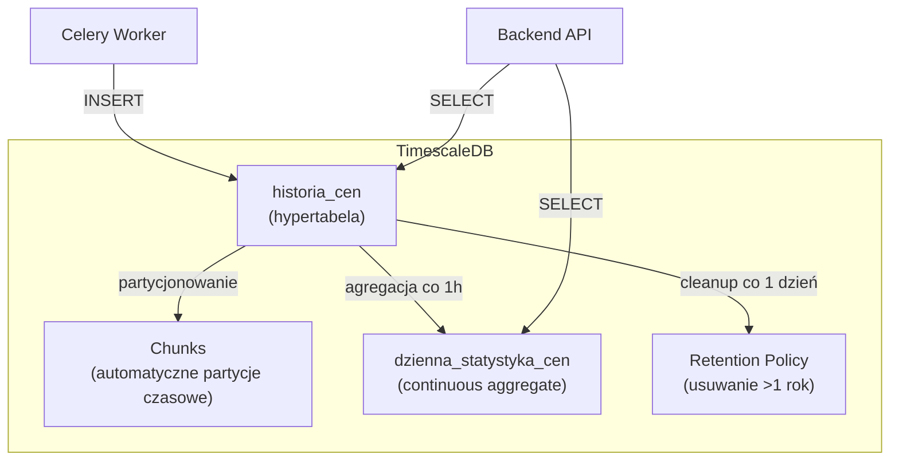

# Schemat TimescaleDB (Szeregi Czasowe)

## 1. Wprowadzenie

TimescaleDB to rozszerzenie PostgreSQL zoptymalizowane dla szeregów czasowych. W systemie Price History przechowuje historię cen wszystkich sprzedawców dla wszystkich produktów, co może osiągnąć miliony rekordów.

**Konfiguracja:**
- Wersja: TimescaleDB latest-pg15
- Port: 5433 (osobna instancja od głównego PostgreSQL)
- Database: `price_timeseries`

**Dlaczego TimescaleDB?** Zob. `docs/decyzje/adr-002-timescaledb.md`

---

## 2. Architektura przechowywania



---

## 3. Główna hypertabela: `historia_cen`

### 3.1 Definicja

```sql
-- Tabela bazowa
CREATE TABLE historia_cen (
    czas TIMESTAMPTZ NOT NULL,
    produkt_id INTEGER NOT NULL,
    sprzedawca_id INTEGER,
    cena DECIMAL(10,2) NOT NULL,
    waluta VARCHAR(3) DEFAULT 'PLN',
    jest_najnizsza BOOLEAN DEFAULT FALSE
);

-- Konwersja na hypertabelę
SELECT create_hypertable(
    'historia_cen',
    'czas',
    chunk_time_interval => INTERVAL '7 days'
);
```

### 3.2 Kolumny

| Kolumna | Typ | Opis |
|---------|-----|------|
| `czas` | TIMESTAMPTZ | Moment pomiaru ceny (klucz partycjonowania) |
| `produkt_id` | INTEGER | ID produktu (FK do PostgreSQL.produkty) |
| `sprzedawca_id` | INTEGER | ID sprzedawcy (FK do PostgreSQL.sprzedawcy) |
| `cena` | DECIMAL(10,2) | Cena |
| `waluta` | VARCHAR(3) | Kod waluty (PLN, EUR, USD) |
| `jest_najnizsza` | BOOLEAN | Flag: czy to najniższa cena dla produktu w tym pomiarze |

### 3.3 Strategia zapisu

Przy każdym sprawdzeniu produktu (fetch) zapisujemy:
1. **Wszystkie ceny sprzedawców** - jeden rekord per sprzedawca
2. **Flagę `jest_najnizsza`** ustawiamy na TRUE dla minimum

**Przykład:** Produkt RTX 4080 na Amazon, 5 sprzedawców:

```
czas                | produkt_id | sprzedawca_id | cena    | jest_najnizsza
--------------------|------------|---------------|---------|---------------
2026-04-25 10:00:00 |    42      |     7         | 2399.00 | TRUE
2026-04-25 10:00:00 |    42      |     8         | 2449.00 | FALSE
2026-04-25 10:00:00 |    42      |     9         | 2499.00 | FALSE
2026-04-25 10:00:00 |    42      |    10         | 2599.00 | FALSE
2026-04-25 10:00:00 |    42      |    11         | 2799.00 | FALSE
```

**Korzyści:**
- Pełna historia wszystkich sprzedawców (analiza "kto kiedy obniżał")
- Szybkie zapytania o najniższą cenę (indeks na `jest_najnizsza`)
- Wykresy mogą pokazywać tylko najniższe ceny (główny widok) lub wszystkie (szczegółowy widok)

---

## 4. Indeksy

```sql
-- Główny indeks: szybkie zapytania per produkt po czasie
CREATE INDEX idx_historia_cen_produkt
    ON historia_cen (produkt_id, czas DESC);

-- Indeks dla najniższych cen (najczęstsze zapytania - wykresy)
CREATE INDEX idx_historia_cen_najnizsza
    ON historia_cen (produkt_id, czas DESC)
    WHERE jest_najnizsza = TRUE;

-- Indeks dla analizy konkretnego sprzedawcy
CREATE INDEX idx_historia_cen_sprzedawca
    ON historia_cen (sprzedawca_id, produkt_id, czas DESC);
```

**Strategia partial index:** `idx_historia_cen_najnizsza` jest mały (tylko ~1/N rekordów gdzie N = liczba sprzedawców), ale obsługuje 80% zapytań (wykresy najniższych cen).

---

## 5. Continuous Aggregate: `dzienna_statystyka_cen`

Zmaterializowany widok aktualizowany automatycznie przez TimescaleDB.

### 5.1 Definicja

```sql
CREATE MATERIALIZED VIEW dzienna_statystyka_cen
WITH (timescaledb.continuous) AS
SELECT
    time_bucket('1 day', czas) AS dzien,
    produkt_id,
    AVG(cena) AS srednia_cena,
    MIN(cena) AS min_cena,
    MAX(cena) AS max_cena,
    STDDEV(cena) AS odchylenie_std,
    COUNT(*) AS liczba_pomiarow
FROM historia_cen
WHERE jest_najnizsza = TRUE  -- Tylko najniższe ceny
GROUP BY dzien, produkt_id;

-- Polityka odświeżania: co 1h, agreguj dane starsze niż 1h
SELECT add_continuous_aggregate_policy(
    'dzienna_statystyka_cen',
    start_offset => INTERVAL '30 days',
    end_offset => INTERVAL '1 hour',
    schedule_interval => INTERVAL '1 hour'
);
```

### 5.2 Zastosowanie

| Zapytanie | Bez agregacji | Z agregacją |
|-----------|---------------|-------------|
| Średnia cena z 30 dni | Skanuje ~30 × N_sprzedawców rekordów dziennie | Skanuje 30 rekordów |
| Wykres dzienny (90 dni) | Wymaga GROUP BY w runtime | Bezpośredni SELECT |

**Speedup:** 100-1000x dla zapytań analitycznych.

### 5.3 Real-time aggregation

TimescaleDB obsługuje **real-time** continuous aggregates - zwraca dane z materialized view + świeże dane z hypertable, nawet jeśli view nie został jeszcze odświeżony.

---

## 6. Retention Policy

Automatyczne usuwanie starych danych (cleanup):

```sql
SELECT add_retention_policy(
    'historia_cen',
    INTERVAL '1 year'
);
```

**Strategia:**
- Surowe dane: 1 rok
- Agregaty dzienne: 5 lat (osobna polityka, jeśli potrzeba)
- Po roku: dane są usuwane chunk-by-chunk (szybkie, atomowe)

**Uzasadnienie 1 roku:**
- Większość użytkowników interesuje się historią 30-90 dni
- Trendy roczne (sezonowość) wymagają min. 1 roku
- Po roku dane historyczne mają niską wartość dla użytkownika

---

## 7. Compression (opcjonalnie)

Dla starszych chunks (>30 dni) można włączyć kompresję:

```sql
ALTER TABLE historia_cen SET (
    timescaledb.compress,
    timescaledb.compress_segmentby = 'produkt_id',
    timescaledb.compress_orderby = 'czas DESC'
);

SELECT add_compression_policy('historia_cen', INTERVAL '30 days');
```

**Korzyści:**
- 10-90% redukcja rozmiaru dla danych szeregów czasowych
- Zapytania na skompresowanych chunks działają normalnie

**Uwaga:** Kompresja może być włączona w późniejszej fazie (optymalizacja).

---

## 8. Wzorce zapytań

### 8.1 Wykres najniższych cen produktu (ostatnie 30 dni)

```sql
SELECT
    time_bucket('1 hour', czas) AS bucket,
    MIN(cena) AS cena
FROM historia_cen
WHERE produkt_id = 42
  AND jest_najnizsza = TRUE
  AND czas >= NOW() - INTERVAL '30 days'
GROUP BY bucket
ORDER BY bucket;
```

### 8.2 Statystyki produktu (do detekcji anomalii)

```sql
SELECT
    AVG(cena) AS srednia,
    STDDEV(cena) AS odchylenie_std,
    COUNT(*) AS liczba_pomiarow
FROM historia_cen
WHERE produkt_id = 42
  AND jest_najnizsza = TRUE
  AND czas >= NOW() - INTERVAL '14 days';
```

### 8.3 Historia konkretnego sprzedawcy

```sql
SELECT czas, cena
FROM historia_cen
WHERE sprzedawca_id = 7
  AND produkt_id = 42
ORDER BY czas DESC
LIMIT 100;
```

### 8.4 Najniższa cena obecnie (cross-platform comparison)

Realizowane w aplikacji jako agregacja z wielu produktów (per platforma) w grupie. Zob. `wzorce-zapytan.md`.

---

## 9. Integracja z Django

System używa **multi-database routing** w Django:

```python
# settings.py
DATABASES = {
    'default': {
        'ENGINE': 'django.db.backends.postgresql',
        'NAME': 'price_history',
        'HOST': 'localhost',
        'PORT': 5432,
    },
    'timeseries': {
        'ENGINE': 'django.db.backends.postgresql',
        'NAME': 'price_timeseries',
        'HOST': 'localhost',
        'PORT': 5433,
    }
}

DATABASE_ROUTERS = ['config.routers.PriceHistoryRouter']
```

**Router logic:**
- Model `HistoriaCen` → baza `timeseries`
- Wszystkie inne modele → baza `default`

---

## 10. Backup i recovery

### 10.1 Strategia backupów

- **Continuous archiving** PostgreSQL (WAL)
- **Pełny backup** raz dziennie (`pg_dump`)
- **Retention backupów:** 30 dni

### 10.2 Recovery point objective (RPO)

- Akceptowalna utrata danych: do 1 godziny
- Recovery time: <30 minut

### 10.3 Special considerations dla TimescaleDB

```bash
# Backup z zachowaniem hypertable structure
pg_dump --format=custom --file=backup.dump price_timeseries

# Restore
pg_restore --dbname=price_timeseries backup.dump
```

---

## 11. Monitorowanie

### 11.1 Kluczowe metryki

| Metryka | Opis | Próg alarmu |
|---------|------|-------------|
| Rozmiar hypertabeli | Suma rozmiaru chunks | > 100 GB |
| Liczba chunks | Bieżące chunks | > 200 |
| Lag continuous aggregate | Opóźnienie agregatu | > 2h |
| Liczba INSERTs/sec | Tempo zapisu | > 1000/s |

### 11.2 Useful queries

```sql
-- Rozmiar hypertabeli
SELECT hypertable_size('historia_cen');

-- Liczba chunks
SELECT COUNT(*) FROM timescaledb_information.chunks
WHERE hypertable_name = 'historia_cen';

-- Status retention policy
SELECT * FROM timescaledb_information.jobs
WHERE proc_name = 'policy_retention';
```

---

## 12. Skalowanie

### 12.1 Vertical scaling

- Zwiększenie RAM (TimescaleDB intensywnie używa cache)
- Szybkie SSD dla chunks aktywnych
- Tuning `shared_buffers`, `work_mem`

### 12.2 Horizontal scaling (przyszłość)

- **TimescaleDB Multi-Node** - dystrybucja chunks na wiele węzłów
- **Read replicas** - dla zapytań analitycznych
- **Tablespace separation** - hot/cold storage

---

## 13. Migracje

Migracje TimescaleDB wymagają specjalnej obsługi (nie wszystkie ALTER TABLE działają na hypertabelach):

```python
# Django migration example
from django.db import migrations

class Migration(migrations.Migration):
    operations = [
        migrations.RunSQL(
            sql="""
                SELECT create_hypertable('historia_cen', 'czas',
                    chunk_time_interval => INTERVAL '7 days');
            """,
            reverse_sql="-- Hypertable cannot be reverted easily"
        )
    ]
```

Szczegóły strategii migracji: `migrations-strategy.md`.
