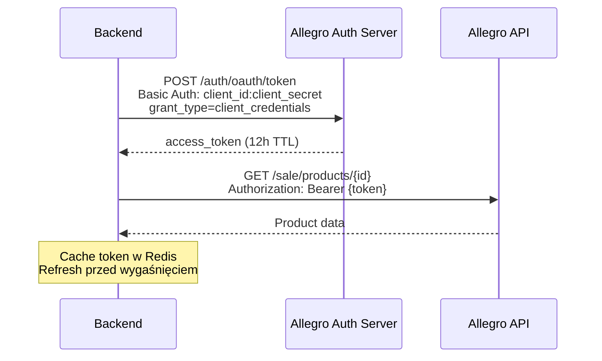

# Integracja z Allegro API

## 1. Wprowadzenie

Allegro udostępnia oficjalne REST API, którego używamy do pobierania cen produktów. W przeciwieństwie do Amazona (scraping), Allegro API zapewnia stabilny, wspierany interfejs.

**Cel:** Pobieranie cen WSZYSTKICH ofert (sprzedawców) dla danego produktu na Allegro.

**Dokumentacja oficjalna:** https://developer.allegro.pl/

---

## 2. Konfiguracja konta deweloperskiego

### 2.1 Wymagania

1. Konto Allegro (zwykłe, nie firmowe)
2. Rejestracja aplikacji w Developer Portal
3. Wybór typu OAuth: **Client Credentials Grant** (nie potrzebujemy uprawnień użytkownika)

### 2.2 Rejestracja aplikacji

1. Wejdź na https://apps.developer.allegro.pl/
2. Zaloguj się kontem Allegro
3. **Zarejestruj nową aplikację**:
   - Typ: aplikacja webowa lub usługa
   - Uprawnienia: tylko `allegro:api:sale:offers:read`, `allegro:api:products:read`
4. Otrzymaj **Client ID** i **Client Secret**

### 2.3 Sandbox vs Production

| Środowisko | URL | Cel |
|------------|-----|-----|
| Sandbox | `https://api.allegro.pl.allegrosandbox.pl` | Testowanie podczas developmentu |
| Production | `https://api.allegro.pl` | Produkcja |

**Uwaga:** Sandbox ma ograniczone dane (mniej produktów). Do testów scrapera lepiej użyć Production z niskim rate limit.

---

## 3. Uwierzytelnianie OAuth2

### 3.1 Flow: Client Credentials

Używamy najprostszego flow OAuth2 - **Client Credentials Grant** (bez user consent).



### 3.2 Endpoint autoryzacji

```
POST https://allegro.pl/auth/oauth/token
Headers:
  Authorization: Basic <base64(client_id:client_secret)>
  Content-Type: application/x-www-form-urlencoded
Body:
  grant_type=client_credentials
```

**Response:**
```json
{
    "access_token": "eyJhbGciOi...",
    "token_type": "Bearer",
    "expires_in": 43199,
    "scope": "allegro:api:sale:offers:read allegro:api:products:read"
}
```

### 3.3 Zarządzanie tokenem

```python
class AllegroAuthClient:
    """Manages OAuth2 token lifecycle."""

    TOKEN_CACHE_KEY = "allegro:access_token"
    TOKEN_TTL_BUFFER = 300  # Refresh 5 min before expiry

    def get_token(self) -> str:
        """Returns valid access token, refreshing if necessary."""
        token = redis_client.get(self.TOKEN_CACHE_KEY)
        if token:
            return token.decode()

        return self._fetch_new_token()

    def _fetch_new_token(self) -> str:
        response = requests.post(
            "https://allegro.pl/auth/oauth/token",
            auth=(settings.ALLEGRO_CLIENT_ID, settings.ALLEGRO_CLIENT_SECRET),
            data={"grant_type": "client_credentials"},
            timeout=10
        )
        response.raise_for_status()
        data = response.json()

        token = data["access_token"]
        ttl = data["expires_in"] - self.TOKEN_TTL_BUFFER
        redis_client.setex(self.TOKEN_CACHE_KEY, ttl, token)

        return token
```

**Strategia cache:**
- Token cache'owany w Redis na czas TTL minus 5 minut (buffer)
- Następne żądania używają cached tokena
- Po wygaśnięciu - automatyczne odświeżenie

---

## 4. Ekstrakcja Product ID z URL

### 4.1 Format URL Allegro

URL produktu na Allegro może mieć kilka formatów:

```
https://allegro.pl/oferta/karta-graficzna-rtx-4080-12345678
https://allegro.pl/oferta/12345678
https://allegro.pl/produkt/karta-graficzna-rtx-4080-{product_id}
```

**Uwaga:** Allegro rozróżnia **oferty** (offers) i **produkty** (products):
- Oferta = pojedyncza pozycja jednego sprzedawcy
- Produkt = abstrakcyjny "produkt" mający wiele ofert

Aby śledzić **wszystkich sprzedawców**, potrzebujemy **product_id** lub musimy przejść z offer_id → product_id.

### 4.2 Ekstrakcja ID

```python
import re
from urllib.parse import urlparse

def extract_allegro_id(url: str) -> tuple[str, str]:
    """
    Extract ID from Allegro URL.

    Returns:
        Tuple (id_type, id) where id_type is 'offer' or 'product'.
    """
    parsed = urlparse(url)

    if 'allegro.pl' not in parsed.netloc:
        raise ValueError("Not an Allegro URL")

    # Format: /oferta/{slug-with-id} or /oferta/{id}
    offer_match = re.search(r'/oferta/(?:.*-)?(\d+)/?$', parsed.path)
    if offer_match:
        return ('offer', offer_match.group(1))

    # Format: /produkt/{slug}
    product_match = re.search(r'/produkt/(.+?)/?$', parsed.path)
    if product_match:
        return ('product', product_match.group(1))

    raise ValueError(f"Cannot extract ID from URL: {url}")
```

### 4.3 Konwersja offer → product

Jeśli użytkownik podał link do oferty, musimy znaleźć product_id, aby pobrać oferty wszystkich sprzedawców:

```python
def get_product_id_from_offer(offer_id: str, token: str) -> str | None:
    """
    Given an offer ID, find the underlying product ID.

    Returns None if offer is not linked to a product.
    """
    response = requests.get(
        f"https://api.allegro.pl/sale/product-offers/{offer_id}",
        headers={"Authorization": f"Bearer {token}",
                 "Accept": "application/vnd.allegro.public.v1+json"},
        timeout=10
    )

    if response.status_code != 200:
        return None

    data = response.json()
    product = data.get("product")
    return product["id"] if product else None
```

---

## 5. Pobieranie cen produktu

### 5.1 Endpoint listy ofert

```
GET /offers/listing
```

**Query params:**
- `phrase` (optional) - wyszukiwanie po nazwie
- `category.id` (optional) - kategoria
- `product.id` (recommended) - konkretny product_id
- `sort` - sortowanie (np. `+price` ascending)
- `limit` - max 60

### 5.2 Implementacja klienta

```python
class AllegroClient:
    BASE_URL = "https://api.allegro.pl"

    def __init__(self, auth_client: AllegroAuthClient):
        self.auth = auth_client

    def get_product_offers(self, product_id: str) -> list[dict]:
        """
        Fetch ALL offers for a given product, sorted by price ascending.

        Returns list of offers with seller info and prices.
        """
        token = self.auth.get_token()
        all_offers = []
        offset = 0
        limit = 60

        while True:
            response = requests.get(
                f"{self.BASE_URL}/offers/listing",
                headers={
                    "Authorization": f"Bearer {token}",
                    "Accept": "application/vnd.allegro.public.v1+json"
                },
                params={
                    "product.id": product_id,
                    "sort": "+price",
                    "limit": limit,
                    "offset": offset
                },
                timeout=10
            )
            response.raise_for_status()

            data = response.json()
            offers = data.get("items", {}).get("regular", [])

            if not offers:
                break

            all_offers.extend(offers)

            # Pagination
            total = data.get("searchMeta", {}).get("availableCount", 0)
            offset += limit
            if offset >= total or offset >= 300:  # Hard limit
                break

        return all_offers
```

### 5.3 Format odpowiedzi

```json
{
    "items": {
        "regular": [
            {
                "id": "12345678",
                "name": "Karta graficzna RTX 4080 SUPER",
                "category": {"id": "260019"},
                "seller": {
                    "id": "98765",
                    "login": "SuperSklep",
                    "superSeller": true,
                    "rating": {
                        "positive": 99.8,
                        "neutral": 0.1,
                        "negative": 0.1
                    }
                },
                "sellingMode": {
                    "format": "BUY_NOW",
                    "price": {
                        "amount": "2499.00",
                        "currency": "PLN"
                    },
                    "popularity": 50
                },
                "stock": {
                    "available": 5,
                    "unit": "UNIT"
                },
                "publication": {
                    "endingAt": "2026-05-25T10:00:00.000Z"
                }
            }
        ]
    },
    "searchMeta": {
        "availableCount": 47,
        "totalCount": 47
    }
}
```

### 5.4 Mapowanie na model bazy danych

```python
def map_allegro_offer_to_price_record(offer: dict, produkt_id: int) -> dict:
    """Convert Allegro offer to PriceRecord format."""
    seller_data = offer["seller"]
    price_data = offer["sellingMode"]["price"]

    return {
        "produkt_id": produkt_id,
        "sprzedawca": {
            "zewnetrzny_id": seller_data["id"],
            "nazwa": seller_data["login"],
            "ocena": seller_data.get("rating", {}).get("positive"),
        },
        "cena": Decimal(price_data["amount"]),
        "waluta": price_data["currency"],
        "czas": timezone.now()
    }
```

---

## 6. Pobieranie metadanych produktu

Przy pierwszym dodaniu produktu pobieramy nazwę, opis, obrazek:

```python
def get_product_details(product_id: str) -> dict:
    token = self.auth.get_token()

    response = requests.get(
        f"{self.BASE_URL}/sale/products/{product_id}",
        headers={
            "Authorization": f"Bearer {token}",
            "Accept": "application/vnd.allegro.public.v1+json"
        },
        timeout=10
    )
    response.raise_for_status()

    data = response.json()
    return {
        "nazwa": data["name"],
        "url_obrazka": data["images"][0]["url"] if data.get("images") else None,
        "kategoria": data.get("category", {}).get("name"),
    }
```

---

## 7. Rate limiting

### 7.1 Limity Allegro API

| Endpoint | Limit |
|----------|-------|
| `/offers/listing` | **9 000 req/min** dla aplikacji |
| `/sale/products/{id}` | **6 000 req/min** |
| `/auth/oauth/token` | 1 000 req/min |

### 7.2 Strategia w naszym systemie

Realnie zużycie:
- 1 produkt = 1 request `/offers/listing` (lub 2-5 dla paginacji)
- Smart polling: max 1000 produktów co 15 min = ~70 req/min - **daleko poniżej limitów**

**Zabezpieczenie:** Token bucket w Celery jako extra warstwa.

```python
from celery import shared_task
from django.core.cache import cache

class AllegroRateLimiter:
    BUCKET_KEY = "allegro:rate_limit"
    MAX_REQUESTS_PER_MINUTE = 5000  # Margines bezpieczeństwa (60% limitu)

    def acquire(self):
        """Block until request can be made."""
        # Implementacja sliding window counter w Redis
        ...
```

---

## 8. Obsługa błędów

### 8.1 Kody odpowiedzi HTTP

| Kod | Znaczenie | Akcja |
|-----|-----------|-------|
| 200 | OK | Process response |
| 400 | Bad Request | Log + skip (nie retry) |
| 401 | Unauthorized | Refresh token + retry |
| 403 | Forbidden | Log + flag oferty (np. wycofana) |
| 404 | Not Found | Mark produkt jako niedostępny |
| 429 | Too Many Requests | Backoff + retry (exponential) |
| 5xx | Server Error | Retry (max 3x) |

### 8.2 Implementacja retry

```python
from celery import Task
from celery.exceptions import Retry

class AllegroFetchTask(Task):
    autoretry_for = (requests.exceptions.RequestException,)
    max_retries = 3
    retry_backoff = True
    retry_backoff_max = 600  # max 10 min
    retry_jitter = True

    def fetch_with_retry(self, product_id):
        try:
            return self.client.get_product_offers(product_id)
        except requests.HTTPError as e:
            if e.response.status_code == 429:
                # Rate limit - czekaj dłużej
                raise self.retry(countdown=60)
            elif e.response.status_code == 404:
                # Produkt zniknął
                self.mark_product_unavailable(product_id)
                return []
            raise
```

### 8.3 Log błędów

Wszystkie błędy logujemy do tabeli `bledy_pobierania` (opcjonalna):

```sql
CREATE TABLE bledy_pobierania (
    id SERIAL PRIMARY KEY,
    produkt_id INTEGER REFERENCES produkty(id),
    czas TIMESTAMP DEFAULT NOW(),
    typ_bledu VARCHAR(50),     -- 'rate_limit', 'auth_failed', 'not_found', etc.
    kod_http INTEGER,
    wiadomosc TEXT
);
```

---

## 9. Testowanie

### 9.1 Mock Allegro API

W testach używamy `responses` library do mockowania:

```python
import responses

@responses.activate
def test_get_product_offers():
    responses.add(
        responses.GET,
        "https://api.allegro.pl/offers/listing",
        json={"items": {"regular": [...]}, "searchMeta": {"availableCount": 5}},
        status=200
    )

    client = AllegroClient(mock_auth)
    offers = client.get_product_offers("12345")

    assert len(offers) == 5
```

### 9.2 Integration tests

Z prawdziwym sandbox API (rzadko, manualne):

```python
@pytest.mark.integration
def test_real_allegro_api():
    """Run with: pytest -m integration --allegro-creds=..."""
    client = AllegroClient.from_env()
    offers = client.get_product_offers("known_test_product_id")
    assert len(offers) > 0
```

---

## 10. Zmienne środowiskowe

```bash
# .env
ALLEGRO_CLIENT_ID=your_client_id
ALLEGRO_CLIENT_SECRET=your_client_secret
ALLEGRO_API_BASE_URL=https://api.allegro.pl  # lub sandbox
ALLEGRO_AUTH_URL=https://allegro.pl/auth/oauth/token
```

---

## 11. Powiązane dokumenty

- [Detekcja platformy z URL](detekcja-platformy.md)
- [Amazon scraper](amazon-scraper.md) - alternatywne źródło
- [Architektura Celery](../zadania-w-tle/architektura-celery.md)
