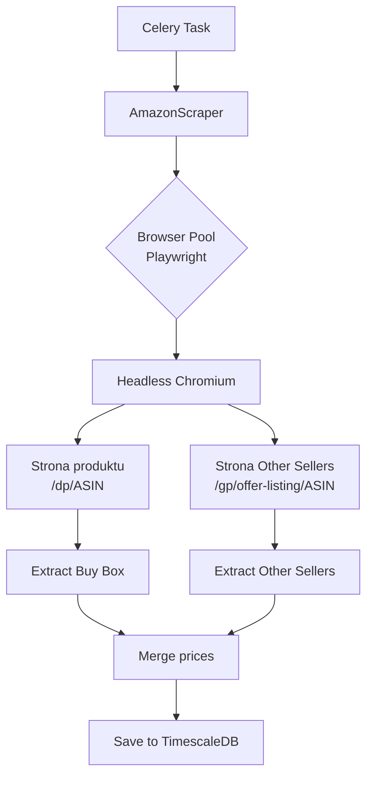

# Scraper Amazon (Playwright)

## 1. Wprowadzenie

Amazon nie udostępnia darmowego API dla deweloperów (Product Advertising API wymaga aktywnego konta affiliate). Z tego powodu używamy **web scrapingu** za pomocą biblioteki **Playwright**.

**Cel:** Pobieranie cen WSZYSTKICH sprzedawców (Buy Box + "Other Sellers") dla danego produktu na Amazon.

**Wybrana biblioteka:** Playwright (Python)

---

## 2. Architektura scrapera



---

## 3. Ekstrakcja ASIN z URL

### 3.1 Format URL Amazon

```
https://www.amazon.pl/dp/B0CHX1W1XZ
https://www.amazon.pl/dp/B0CHX1W1XZ/ref=sr_1_1?...
https://www.amazon.pl/Karta-graficzna-RTX-4080/dp/B0CHX1W1XZ
https://amzn.eu/d/B0CHX1W1XZ
https://www.amazon.de/-/en/dp/B0CHX1W1XZ
```

**ASIN** to 10-znakowy identyfikator (litery + cyfry), zawsze obecny w URL.

### 3.2 Implementacja

```python
import re
from urllib.parse import urlparse

ASIN_PATTERN = re.compile(r'/dp/([A-Z0-9]{10})(?:[/?]|$)')

def extract_asin(url: str) -> str:
    """
    Extract 10-character ASIN from Amazon URL.

    Raises ValueError if URL doesn't contain valid ASIN.
    """
    match = ASIN_PATTERN.search(url)
    if not match:
        raise ValueError(f"Cannot extract ASIN from URL: {url}")

    return match.group(1)


def detect_amazon_domain(url: str) -> str:
    """Returns Amazon domain (amazon.pl, amazon.de, etc.)"""
    parsed = urlparse(url)
    if 'amazon' not in parsed.netloc:
        raise ValueError("Not an Amazon URL")
    return parsed.netloc
```

---

## 4. Konfiguracja Playwright

### 4.1 Instalacja

```bash
pip install playwright
playwright install chromium  # Pobiera Chromium binary
```

### 4.2 Browser pool

Zamiast uruchamiać nowy browser dla każdego scrape (kosztowne), używamy **browser pool**:

```python
from playwright.async_api import async_playwright, Browser
from contextlib import asynccontextmanager

class BrowserPool:
    def __init__(self, max_browsers: int = 3):
        self.max_browsers = max_browsers
        self.playwright = None
        self.browsers: list[Browser] = []
        self.semaphore = asyncio.Semaphore(max_browsers)

    async def start(self):
        self.playwright = await async_playwright().start()

    @asynccontextmanager
    async def get_browser(self):
        async with self.semaphore:
            browser = await self.playwright.chromium.launch(
                headless=True,
                args=[
                    '--disable-blink-features=AutomationControlled',
                    '--disable-dev-shm-usage',
                    '--no-sandbox',
                ]
            )
            try:
                yield browser
            finally:
                await browser.close()
```

### 4.3 Context per request

Każdy request używa świeżego browser context (jak nowa sesja przeglądarki):

```python
async def fetch_with_context(browser: Browser, url: str):
    context = await browser.new_context(
        user_agent=random_user_agent(),
        viewport={"width": 1920, "height": 1080},
        locale="pl-PL",
        timezone_id="Europe/Warsaw"
    )

    # Block obrazki/CSS dla szybkości
    await context.route("**/*.{png,jpg,jpeg,gif,webp,css,woff,woff2}",
                        lambda route: route.abort())

    page = await context.new_page()
    try:
        await page.goto(url, wait_until="domcontentloaded", timeout=30000)
        return await extract_data(page)
    finally:
        await context.close()
```

---

## 5. Anti-bot measures

### 5.1 Strategie ochrony Amazona

Amazon wykrywa boty przez:
1. **User-Agent** - wykrywanie headless browsers
2. **Browser fingerprinting** - canvas, WebGL, fonts
3. **Behavior** - speed, mouse movements, click patterns
4. **CAPTCHA** - "Are you a human?" dla podejrzanych żądań
5. **IP rate limiting** - zbyt wiele requestów z jednego IP

### 5.2 Mitygacja

#### User-Agent rotation

```python
USER_AGENTS = [
    "Mozilla/5.0 (Windows NT 10.0; Win64; x64) AppleWebKit/537.36 (KHTML, like Gecko) Chrome/120.0.0.0 Safari/537.36",
    "Mozilla/5.0 (Macintosh; Intel Mac OS X 10_15_7) AppleWebKit/537.36 (KHTML, like Gecko) Chrome/120.0.0.0 Safari/537.36",
    "Mozilla/5.0 (Windows NT 10.0; Win64; x64; rv:121.0) Gecko/20100101 Firefox/121.0",
    # 10-15 różnych UA
]

def random_user_agent() -> str:
    return random.choice(USER_AGENTS)
```

#### Stealth mode

Biblioteka `playwright-stealth` ukrywa charakterystyki headless browsera:

```python
from playwright_stealth import stealth_async

async def fetch_with_stealth(browser, url):
    context = await browser.new_context(...)
    page = await context.new_page()
    await stealth_async(page)
    await page.goto(url)
    return await extract_data(page)
```

#### Random delays

```python
import random
import asyncio

async def human_like_delay():
    """Random 1-3 second delay before action."""
    await asyncio.sleep(random.uniform(1.0, 3.0))
```

#### Rate limiting po IP

```python
class IPRateLimiter:
    """Max 1 request / 30 sec per Amazon domain."""

    MIN_DELAY_SECONDS = 30

    async def wait_if_needed(self, domain: str):
        last_request = redis.get(f"amazon:last:{domain}")
        if last_request:
            elapsed = time.time() - float(last_request)
            if elapsed < self.MIN_DELAY_SECONDS:
                await asyncio.sleep(self.MIN_DELAY_SECONDS - elapsed)
        redis.set(f"amazon:last:{domain}", time.time())
```

### 5.3 Detekcja CAPTCHA

Jeśli Amazon pokazuje CAPTCHA, scraping nie zadziała:

```python
async def detect_captcha(page) -> bool:
    """Check if Amazon shows CAPTCHA challenge."""
    captcha_indicators = [
        'form[action*="/errors/validateCaptcha"]',
        'img[src*="captcha"]',
        'text=Enter the characters you see',
    ]

    for indicator in captcha_indicators:
        if await page.locator(indicator).count() > 0:
            return True
    return False


async def fetch_with_captcha_check(page, url):
    await page.goto(url)

    if await detect_captcha(page):
        raise CaptchaDetectedException(
            f"CAPTCHA shown for {url}. Backing off."
        )
```

**Reakcja na CAPTCHA:**
- Zwiększ delay (np. cooldown 1h)
- Zmień User-Agent
- Log incydentu do monitoringu

---

## 6. Ekstrakcja danych

### 6.1 Strona produktu (`/dp/ASIN`)

DOM Amazona zmienia się często. Używamy wielu fallback selektorów:

```python
PRICE_SELECTORS = [
    'span.a-price[data-a-size="xl"] span.a-offscreen',
    'span.a-price-whole',
    '#priceblock_ourprice',
    '#priceblock_dealprice',
    '#corePrice_feature_div .a-offscreen',
]

NAME_SELECTORS = [
    '#productTitle',
    'h1.product-title',
]

IMAGE_SELECTORS = [
    '#landingImage',
    '#main-image',
    'img.a-dynamic-image',
]

async def extract_buy_box(page) -> dict | None:
    """Extract Buy Box winner price."""
    for selector in PRICE_SELECTORS:
        try:
            element = page.locator(selector).first
            if await element.count() > 0:
                price_text = await element.inner_text()
                price = parse_price(price_text)
                if price:
                    seller = await extract_buy_box_seller(page)
                    return {
                        "cena": price,
                        "sprzedawca": seller,
                        "is_buy_box": True
                    }
        except Exception:
            continue
    return None
```

### 6.2 Parsowanie ceny

Format ceny różni się per region:

```
PL: 2 499,99 zł
DE: 2.499,99 €
US: $2,499.99
```

```python
import re
from decimal import Decimal

def parse_price(text: str) -> Decimal | None:
    """
    Parse price from Amazon DOM text.

    Handles formats:
    - "2 499,99 zł" → Decimal("2499.99")
    - "2.499,99 €"  → Decimal("2499.99")
    - "$2,499.99"   → Decimal("2499.99")
    """
    if not text:
        return None

    # Usuń waluty i białe znaki
    cleaned = re.sub(r'[^\d.,]', '', text.strip())

    if not cleaned:
        return None

    # Heurystyka: ostatni separator (.) lub (,) to separator dziesiętny
    last_sep = max(cleaned.rfind('.'), cleaned.rfind(','))
    if last_sep == -1:
        return Decimal(cleaned)

    integer_part = re.sub(r'[.,]', '', cleaned[:last_sep])
    decimal_part = cleaned[last_sep+1:]

    return Decimal(f"{integer_part}.{decimal_part}")
```

### 6.3 Strona Other Sellers (`/gp/offer-listing/ASIN`)

Tu są wszyscy pozostali sprzedawcy:

```python
async def extract_other_sellers(browser, asin: str) -> list[dict]:
    """Fetch and parse all other sellers for product."""
    url = f"https://www.amazon.pl/gp/offer-listing/{asin}/"

    page = await browser.new_page()
    await page.goto(url, wait_until="domcontentloaded")

    sellers = []
    offer_rows = await page.locator('div#aod-offer').all()

    for row in offer_rows:
        try:
            price_text = await row.locator('.a-price .a-offscreen').first.inner_text()
            seller_name = await row.locator('#aod-offer-soldBy a').first.inner_text()
            seller_url = await row.locator('#aod-offer-soldBy a').first.get_attribute('href')
            condition = await row.locator('#aod-offer-heading').first.inner_text()

            # Tylko nowe produkty
            if 'Nowy' not in condition and 'New' not in condition:
                continue

            sellers.append({
                "cena": parse_price(price_text),
                "sprzedawca": {
                    "nazwa": seller_name.strip(),
                    "url_profilu": seller_url
                }
            })
        except Exception as e:
            logger.warning(f"Failed to parse seller row: {e}")
            continue

    await page.close()
    return sellers
```

### 6.4 Pełna funkcja scrape

```python
async def scrape_amazon_product(asin: str, domain: str = "amazon.pl") -> dict:
    """
    Scrape product info + Buy Box + Other Sellers.

    Returns:
        {
            "name": str,
            "image_url": str,
            "buy_box": {"cena": Decimal, "sprzedawca": dict} | None,
            "other_sellers": list[dict]
        }
    """
    async with browser_pool.get_browser() as browser:
        # Strona produktu
        product_url = f"https://www.{domain}/dp/{asin}"
        product_data = await fetch_product_page(browser, product_url)

        # Other sellers
        other_sellers = await extract_other_sellers(browser, asin)

    return {
        "name": product_data["name"],
        "image_url": product_data["image_url"],
        "buy_box": product_data.get("buy_box"),
        "other_sellers": other_sellers
    }
```

---

## 7. Mapowanie na model bazy danych

```python
def map_amazon_data_to_price_records(scrape_result: dict, produkt_id: int) -> list[dict]:
    """Convert Amazon scrape result to PriceRecord format."""
    records = []
    timestamp = timezone.now()

    if scrape_result["buy_box"]:
        bb = scrape_result["buy_box"]
        records.append({
            "produkt_id": produkt_id,
            "sprzedawca": bb["sprzedawca"],
            "cena": bb["cena"],
            "waluta": "PLN",
            "czas": timestamp,
            "is_buy_box": True
        })

    for offer in scrape_result["other_sellers"]:
        records.append({
            "produkt_id": produkt_id,
            "sprzedawca": offer["sprzedawca"],
            "cena": offer["cena"],
            "waluta": "PLN",
            "czas": timestamp,
            "is_buy_box": False
        })

    return records
```

---

## 8. Obsługa błędów

### 8.1 Typy błędów

| Błąd | Opis | Akcja |
|------|------|-------|
| `TimeoutError` | Strona za wolno się ładuje | Retry (max 2x) |
| `CaptchaDetectedException` | Amazon pokazał CAPTCHA | Backoff 1h, zmień UA |
| `NoSuchElementError` | DOM się zmienił | Log + alert do dev |
| `ProductNotFound` (404) | ASIN nie istnieje | Mark produkt jako nieaktywny |
| `RateLimitException` | Amazon zwrócił 503 | Exponential backoff |

### 8.2 Retry strategy

```python
@shared_task(
    autoretry_for=(TimeoutError, ConnectionError),
    retry_kwargs={'max_retries': 3, 'countdown': 60},
    retry_backoff=True,
    retry_backoff_max=600,
)
def scrape_amazon_task(produkt_id: int):
    asyncio.run(scrape_amazon_product(...))
```

### 8.3 Monitoring DOM changes

Amazon często zmienia struktury DOM. System powinien:

1. Logować WSZYSTKIE failed scrapes
2. Jeśli > 30% scrapes fails - alert do developera (email/Slack)
3. Tabela `bledy_scrapowania` do śledzenia trendów

```sql
CREATE TABLE bledy_scrapowania (
    id SERIAL PRIMARY KEY,
    produkt_id INTEGER,
    czas TIMESTAMP DEFAULT NOW(),
    typ_bledu VARCHAR(50),
    selektor_failed VARCHAR(255),
    url TEXT,
    wiadomosc TEXT
);
```

---

## 9. Wydajność

### 9.1 Czas wykonania

Typowe wartości:
- Strona produktu: ~3-5 sekund
- Strona other sellers: ~3-5 sekund
- Razem per produkt: ~6-10 sekund

### 9.2 Optymalizacje

#### Block obrazków/CSS

Oszczędność ~40% czasu ładowania:

```python
await context.route(
    "**/*.{png,jpg,jpeg,gif,webp,svg,css,woff,woff2,ttf}",
    lambda route: route.abort()
)
```

#### Equal-network failure

Niektóre zasoby to tracking (Google Analytics, etc.) - można je też blokować:

```python
TRACKER_DOMAINS = ['googletagmanager.com', 'analytics.amazon.com', ...]

await context.route(
    "**/*",
    lambda route: route.abort() if any(d in route.request.url for d in TRACKER_DOMAINS) else route.continue_()
)
```

#### Concurrency

Max 3 równoczesne browsers (więcej = problemy z RAM, większe ryzyko detekcji):

```python
SCRAPER_CONCURRENCY = 3
semaphore = asyncio.Semaphore(SCRAPER_CONCURRENCY)
```

---

## 10. Testowanie

### 10.1 Mock HTML

```python
@pytest.fixture
def amazon_product_html():
    return """
    <html>
        <body>
            <h1 id="productTitle">RTX 4080 SUPER</h1>
            <span class="a-offscreen">2 399,00 zł</span>
        </body>
    </html>
    """

async def test_extract_price(amazon_product_html):
    page = MockPage(amazon_product_html)
    data = await extract_buy_box(page)
    assert data["cena"] == Decimal("2399.00")
```

### 10.2 Testy parsera ceny

```python
@pytest.mark.parametrize("text,expected", [
    ("2 499,99 zł", Decimal("2499.99")),
    ("2.499,99 €", Decimal("2499.99")),
    ("$2,499.99", Decimal("2499.99")),
    ("nieprawidłowa cena", None),
])
def test_parse_price(text, expected):
    assert parse_price(text) == expected
```

### 10.3 Integration tests

Z prawdziwym Amazon (rzadko, ostrożnie):

```python
@pytest.mark.integration
@pytest.mark.skip(reason="Manual test - costs Amazon traffic")
async def test_real_amazon_scrape():
    asin = "B0CHX1W1XZ"  # Stable test ASIN
    result = await scrape_amazon_product(asin)
    assert result["name"]
    assert len(result["other_sellers"]) >= 0
```

---

## 11. Konfiguracja

### 11.1 Zmienne środowiskowe

```bash
# .env
AMAZON_DOMAIN_DEFAULT=amazon.pl
AMAZON_SCRAPER_CONCURRENCY=3
AMAZON_RATE_LIMIT_DELAY_SECONDS=30
AMAZON_TIMEOUT_SECONDS=30
AMAZON_USE_STEALTH=true
```

### 11.2 Settings Django

```python
# settings.py
AMAZON_SCRAPER = {
    'CONCURRENCY': int(os.getenv('AMAZON_SCRAPER_CONCURRENCY', 3)),
    'RATE_LIMIT_DELAY': int(os.getenv('AMAZON_RATE_LIMIT_DELAY_SECONDS', 30)),
    'TIMEOUT': int(os.getenv('AMAZON_TIMEOUT_SECONDS', 30)),
    'USE_STEALTH': os.getenv('AMAZON_USE_STEALTH', 'true').lower() == 'true',
    'USER_AGENTS': USER_AGENTS_LIST,
}
```

---

## 12. Etyka i prawne aspekty

### 12.1 Robots.txt

Amazon `robots.txt` wyraźnie zabrania scrapowania, ale używamy go w celach edukacyjnych (projekt inżynierski).

### 12.2 Terms of Service

Scrapowanie Amazona narusza ToS. **Aplikacja nie powinna być wdrażana komercyjnie** bez zgody Amazona lub użycia Product Advertising API.

### 12.3 Mitygacje

- Niska częstotliwość zapytań (smart polling)
- Identyfikacja użytkownika końcowego (nie scrapowanie masowe)
- Brak republikacji danych
- Tylko do użytku osobistego użytkownika

---

## 13. Powiązane dokumenty

- [Detekcja platformy z URL](detekcja-platformy.md)
- [Allegro API](allegro-api.md)
- [Architektura Celery](../zadania-w-tle/architektura-celery.md)
- [Smart Polling](../zadania-w-tle/smart-polling.md) - jak ograniczamy częstotliwość
